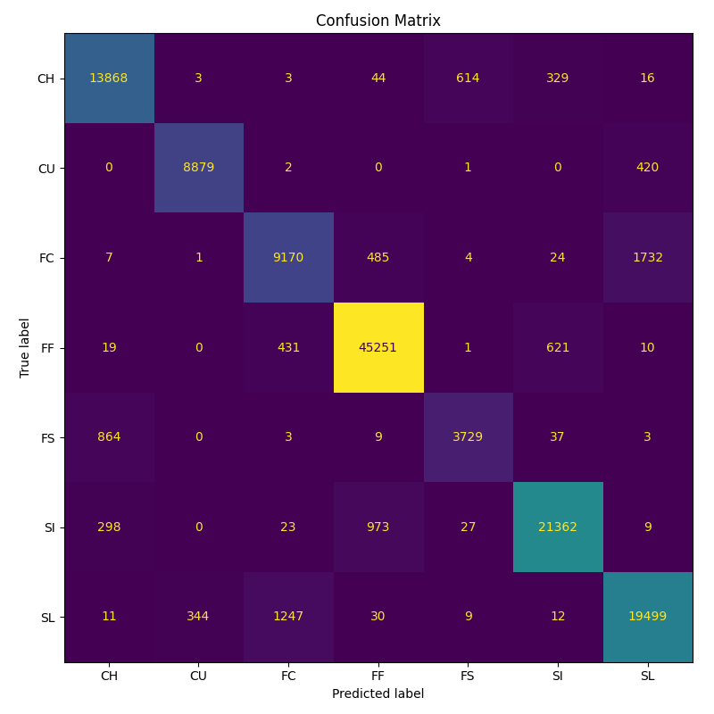
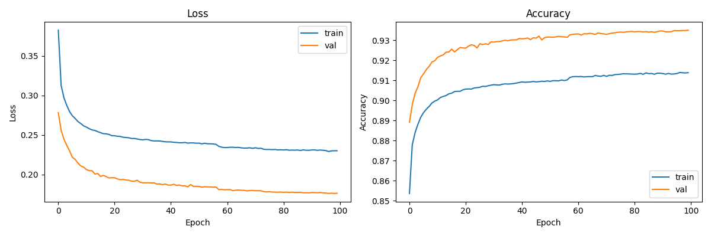

# MLB Pitch Classifier

MLB Statcast 투구 데이터를 기반으로 MLP 신경망이 7가지 구종(포심, 싱커, 슬라이더, 커브, 체인지업, 커터, 스플리터)을 분류하는 딥러닝 애플리케이션입니다.

가천대학교 영상처리 수업 과제로 시작해, 데스크톱 GUI → 웹 데모 → FastAPI 백엔드 분리 → Gemini 기반 자연어 설명 → 실제 MLB 투수 검색 → Streamlit 직접 추론 → 날짜 기반 검색·일일 데이터 자동 수집까지 단계적으로 확장했습니다.

## 🌐 웹 데모

**[Live Demo →](https://mlb-pitch-classifier-tgtrdgldkletpsw43j26sz.streamlit.app/)**

설치 없이 브라우저에서 바로 슬라이더로 가상의 투구를 만들거나, 실제 Statcast 데이터를 업로드하거나, **선수 이름으로 실제 투수의 최근 투구를 검색**해 모델의 예측과 예측 근거를 자연어로 확인할 수 있습니다.

> Streamlit Cloud가 모델을 직접 로드해 추론합니다. 앱 기동 후 첫 예측만 모델 로딩으로 잠시 걸리고, 이후에는 즉시 응답합니다.

<p>
  
  
</p>

## 모델 성능

7개 구종에 대한 weighted F1-score **0.93** (2024~2025 정규시즌, 테스트 세트 130,424건 기준).

| 구종 | F1-Score |
|---|---|
| FF (포심) | 0.97 |
| CU (커브) | 0.96 |
| SI (싱커) | 0.95 |
| CH (체인지업) | 0.93 |
| SL (슬라이더) | 0.91 |
| FS (스플리터) | 0.83 |
| FC (커터) | 0.82 |

FC(커터)와 SL(슬라이더)·FF(포심) 사이의 혼동이 가장 큰 한계로, 세 구종의 물리적 특성이 유사하기 때문입니다.

## 아키텍처

```
Streamlit Cloud (UI + 추론)
    │
    ├── MLP 모델 예측 (TensorFlow, @st.cache_resource 없이 lru_cache로 1회 로드)
    ├── Gemini API 자연어 설명 (실패 시 규칙 기반 설명으로 폴백)
    └── backend/ 의 model_utils.py · explain.py 를 그대로 import 해 재사용

backend/  (로컬 실행용 FastAPI, 동일 추론 코드)
```

Streamlit 앱이 17개 Statcast 피처로 직접 예측 구종·신뢰도·구종별 확률·자연어 설명을
계산합니다. 추론 로직은 `backend/model_utils.py`·`backend/explain.py`에 그대로 두고
Streamlit이 이를 import 해 재사용하므로, 로컬에서는 동일 코드를 FastAPI로도 띄울 수 있습니다.

> 처음에는 예측 API를 Render 무료 플랜의 FastAPI로 분리해뒀지만, 콜드 스타트(최대 ~50초)로
> 데모 UX가 나빠 Streamlit Cloud(24시간 상시 가동)가 모델을 직접 로드하는 구조로 바꿨습니다.
> `backend/`는 로컬 실행·구조 참고용으로 유지합니다.

## 프로젝트 구조

```
├── streamlit_app/       # 웹 UI (Streamlit + Plotly) + 직접 추론
│   ├── app.py
│   ├── utils.py           # backend/ 의 추론 코드를 import 해 예측 + 궤적 계산
│   └── README.md          # 실행 및 배포 방법
│
├── backend/              # 로컬 실행용 예측 API (FastAPI). 추론 코드의 원본
│   ├── main.py            # /predict, /health 엔드포인트
│   ├── model_utils.py     # 모델 로딩 및 추론 (Streamlit이 재사용)
│   ├── explain.py         # Gemini API 기반 자연어 설명 (규칙 기반 폴백 포함, Streamlit이 재사용)
│   ├── model/              # pitch_model.h5, scaler.pkl, label_encoder.pkl (Streamlit도 이 경로에서 로드)
│   └── README.md          # 로컬 실행 방법
│
├── desktop_app/          # 데스크톱 GUI (tkinter, 과제 원본)
│   └── src/
│       ├── data_loader.py
│       ├── model.py
│       ├── train.py
│       ├── predict.py
│       └── MLB_pitch_classifier.py
│   └── README.md
│
├── scripts/
│   └── fetch_daily.py     # 일일 Statcast 자동 수집 스크립트 (GitHub Actions가 실행)
│
├── .github/workflows/
│   └── update_data.yml    # 매일 KST 06:00 전날 데이터를 수집해 커밋하는 워크플로우
│
├── data/                  # 일일 수집된 Statcast 원본 (연도별 gzip CSV, 재학습용 대기 데이터)
├── render.yaml            # 과거 Render 배포 설정 (현재 미사용, 참고용 보존)
└── results/                # 학습 곡선, 혼동 행렬
```

| | `streamlit_app/` | `backend/` | `desktop_app/` |
|---|---|---|---|
| 용도 | 웹 UI + 추론, 포트폴리오 | 로컬 실행용 예측 API, 추론 코드 원본 | 수업 과제 제출본 |
| 실행 환경 | Streamlit Cloud | 로컬 (`uvicorn`) | 로컬 Python GUI |
| 모델 접근 | 직접 로딩 (TensorFlow, `backend/`의 코드 재사용) | 직접 로딩 (TensorFlow) | 직접 로딩 (TensorFlow) |
| 자연어 설명 | Gemini API 호출 + 폴백 (`backend/explain.py` 재사용) | Gemini API 호출 + 폴백 | 없음 |

각 폴더의 README에서 자세한 설치/실행/배포 방법을 확인할 수 있습니다.

## 기술 스택

- **언어/환경**: Python 3.9+ (Streamlit 배포 및 backend는 Python 3.11)
- **딥러닝**: TensorFlow / Keras (3층 MLP, BatchNorm + Dropout)
- **웹 배포**: Streamlit Cloud가 모델을 직접 로드해 추론 (별도 API 서버 없음)
- **로컬 API**: FastAPI + uvicorn (`backend/`)
- **자연어 설명**: Gemini API (`gemini-3.5-flash-lite`), 실패 시 규칙 기반 설명으로 자동 폴백
- **실제 투수 데이터**: [MLB 공식 Stats API](https://statsapi.mlb.com)로 선수 이름 검색(포지션·소속팀·데뷔년도),
  [pybaseball](https://github.com/jldbc/pybaseball)로 해당 선수의 실제 Statcast 투구 데이터 조회
- **웹 UI**: Streamlit + Plotly
- **데스크톱 UI**: tkinter + matplotlib
- **데이터 자동 수집**: GitHub Actions(무료 티어) 스케줄 실행으로 매일 전날 리그 전체 Statcast 데이터를 수집·누적

## 구현 포인트

- **17개 Statcast 피처**(구속, 회전수, 가속도, 릴리스 위치 등) 기반 MLP 분류
- **추론 코드 단일 소스**: `backend/model_utils.py`·`explain.py`에 예측·설명 로직을 두고 Streamlit이 그대로 import 해 재사용. 로컬에서는 같은 코드를 FastAPI로도 기동 가능
- **자연어 설명 + 안전한 폴백**: 예측 구종·신뢰도·2순위 구종·투구 손을 반영한 프롬프트로 Gemini API가
  MLB 해설가 톤의 한국어 설명을 생성하되, API 키가 없거나 호출이 실패/타임아웃/쿼터 초과되어도
  규칙 기반 설명으로 즉시 대체해 `/predict`가 항상 응답
- **투수 이름 자동완성 검색**: 2글자 이상 입력하면 MLB 공식 Stats API로 실시간 부분 검색 →
  투수(P)·투타겸업(TWP, 예: 오타니 쇼헤이처럼 포지션을 바꾼 선수도 과거 투구 기록 조회 가능)만
  필터링 → 소속팀·활동 기간으로 동명이인 구분 → 선택 즉시 좌완/우완과 예측이 자동 반영.
  Statcast 데이터 제공 시점(2015년)에 맞춰 조회 가능한 날짜 범위만 표시
  (전 커리어가 2015년 이전인 선수는 조회 불가 안내)
- **날짜 범위 검색**: 시즌 단위 선택 대신 `st.date_input`으로 시작일·종료일을 직접 지정.
  투수 이름만/날짜 범위만(이름 없이 리그 전체, 서버 부하 방지를 위해 최대 5일·500건 제한)/
  이름+날짜 범위 세 조합을 모두 지원
- **구종 사용 비율 미리보기**: 투수 선택 시 해당 기간 실제 투구의 구종별 사용 비율을 예측 전에 먼저 보여줌
- **1회 모델 로딩**: `lru_cache`로 모델·스케일러·인코더를 프로세스당 1회만 로드해 모든 세션이 공유. 첫 예측에만 로딩 안내와 스피너를 표시
- **좌완/우완 처리**: `p_throws`와 가속도(`ax`) 부호를 함께 반영해 상단뷰 궤적의 좌우 비대칭과
  자연어 설명의 무브먼트 방향을 정확히 계산
- **동적 변수 연동**: 슬라이더의 `vz0`, `vx0`를 `az`, `ax` 값에 비례시켜, 고정값으로 인해 예측이 한 클래스로 쏠리는 문제를 해결
- **일일 Statcast 자동 수집**: GitHub Actions가 매일 KST 06:00에 전날 리그 전체 투구 데이터를
  가져와 `data/statcast_<year>.csv.gz`에 누적. 타겟 날짜는 KST가 아니라 UTC 기준 "실행 시점 - 1일"로
  계산해, 미국 서부 지역 야간 경기가 아직 안 끝난 시점에 조회하는 것을 방지. 원본 118개 컬럼 중
  재학습·검색 UI에 실제 쓰이는 21개만 남기고 gzip 압축해 시즌 전체가 쌓여도 GitHub 파일 크기
  제한(100MB)을 넘지 않도록 함

## 설계 결정

- **왜 MLP인가?**
  투구 데이터는 구속·회전수·가속도 등 17개의 수치형 피처로 구성된 정형 데이터라, 공간 패턴을 보는 CNN이나 시계열을 보는 RNN보다 MLP가 더 적합하다. Statcast 피처 자체가 이미 물리적으로 의미 있는 값들로 정제되어 있어 깊은 특징 추출 없이도 Weighted F1 0.93이 나왔다.

- **왜 BatchNorm + Dropout인가?**
  7개 구종 간 샘플 수 불균형(FF 46,333건 vs FS 4,645건, 테스트 세트 기준)이 존재한다. BatchNorm은 각 층의 입력 분포를 안정시켜 수렴을 빠르게 하고, Dropout은 특정 구종에 과적합되는 것을 방지하기 위해 함께 적용했다.

- **왜 StandardScaler인가?**
  17개 피처의 단위가 제각각이다(구속 60~105mph, 회전수 1500~3500rpm, 가속도 -50~15). 스케일 차이가 학습을 편향시키지 않도록 StandardScaler로 정규화했다. 스케일러는 훈련 세트 기준으로만 fit하고 검증/테스트에는 transform만 적용해 데이터 누수를 방지했다.

- **왜 7개 구종만 분류하는가?**
  Statcast에는 더 많은 구종 코드가 있지만, 샘플이 충분하고 물리적으로 구분 가능한 7개(FF·SI·SL·CU·CH·FC·FS)만 선택했다. 희귀 구종(EP 이팔루스, SC 스크루볼 등)은 데이터가 극히 적어 포함하면 분류 경계가 흐려지는 문제가 있다.

- **왜 처음엔 FastAPI로 분리했다가 다시 직접 로드로 왔는가?**
  처음에는 모델 서빙 로직을 UI 코드에서 떼어내 독립적으로 배포·교체하려고 예측을 FastAPI 백엔드로 분리했다. 하지만 Render 무료 플랜은 트래픽이 없으면 슬립되어 첫 예측이 최대 50초 걸렸고, 이 콜드 스타트가 데모 UX를 크게 해쳤다. Streamlit Cloud는 24시간 켜져 있으므로, Streamlit이 모델을 직접 로드하는 구조로 되돌렸다. `backend/` 코드는 GitHub에 그대로 유지한다 — 로컬 FastAPI 실행용이자 개발 히스토리의 일부다.

## 한계 및 개선 방향

- 학습 데이터가 2024~2025 MLB 정규시즌으로 한정되어 타 리그(KBO 등) 일반화는 제한적
- FS(스플리터)는 다른 구종 대비 샘플 수가 적어 상대적으로 낮은 성능
- Streamlit Cloud 무료 티어(1GB RAM)에서 TensorFlow를 로드하므로 메모리 여유가 크지 않음
- Gemini 무료 티어는 모델별 일일 요청 한도가 있어(예: `gemini-3.6-flash`는 하루 20회),
  트래픽이 몰리면 자연어 설명이 규칙 기반 폴백으로 조용히 전환될 수 있음. 현재는 무료 한도가
  더 넉넉한 `-lite` 계열 모델을 사용 중이며, 유료 티어 전환도 검토 중
- 투수 검색은 실제 투구 데이터 조회에 pybaseball을 쓰기 때문에, MLB 서버 응답이 느리거나
  Statcast에 데이터가 없는 선수/시즌(마이너리그 전용 등)은 조회에 실패할 수 있음
- desktop_app은 예측마다 모델을 재로드해 평균 638ms 소요
- 2026시즌 데이터는 매일 자동 수집만 되고 있고 아직 재학습에는 반영되지 않음 — 진행 중인 시즌
  데이터로 중간에 재학습하면 표본이 편향될 수 있어, 시즌 종료 후 한 번에 반영할 예정

## License

MIT
